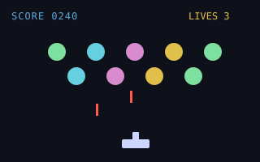
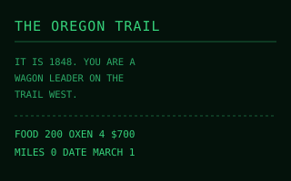
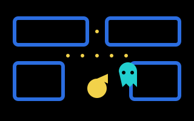
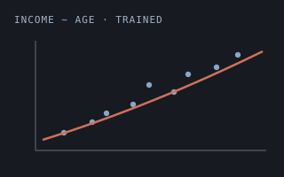
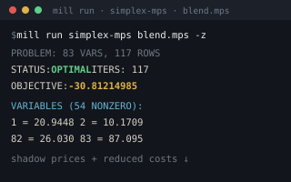
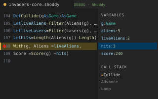

# Shoddy
 
*Useless Things Made Useful Through Skill*

A purely functional BASIC. Friendly typed syntax on the surface —
parenthesized calls, infix operators, `Let`, records, `Select Case`
pattern matching — compiled onto a concatenative (Forth/Joy-style) stack
core that remains a legal dialect. Python's layout, BASIC's keywords,
Joy's soul.

```basic
Include "machines/stats.shoddy"

Type Student
    Name  As String
    Score As Number

Def Grade(s As Student) As String
    Select Case Score(s)
        Case >= 90
            "A"
        Case 70 To 89
            "B-ISH"
        Case Else
            "F"

Def Main()
    Let class = { Student("ADA", 96), Student("LIN", 78) }
    Each(class, Fn(s) => Print(Name(s) & ": " & Grade(s)))
    Print(Average(Map(class, Score)))
```

Nothing mutates: `Let` binds once, updates return new values, iteration
is recursion and `Map`/`Filter`/`Fold`. And the whole surface desugars to
stack code you can also write directly: `Def Square ( Number -- Number )`
/ `Dup *`.

## See it run

Complete programs woven from the machines — each split into a headless,
unit-tested pure core and a thin I/O shell. Click through to the docs.

<table>
  <tr>
    <td width="33%" align="center" valign="top">
      <a href="https://shoddymills.github.io/shoddy/mills/invaders.html"></a><br>
      <b>Invaders</b><br><sub>graphical window · colour + sound</sub>
    </td>
    <td width="33%" align="center" valign="top">
      <a href="https://shoddymills.github.io/shoddy/mills/oregon.html"></a><br>
      <b>The Oregon Trail</b><br><sub>the 1971 classic, reclaimed</sub>
    </td>
    <td width="33%" align="center" valign="top">
      <a href="https://shoddymills.github.io/shoddy/mills/pac-vt100.html"></a><br>
      <b>Pac-VT100</b><br><sub>arcade chase in the terminal</sub>
    </td>
  </tr>
  <tr>
    <td width="33%" align="center" valign="top">
      <a href="https://shoddymills.github.io/shoddy/mills/demographics.html"></a><br>
      <b>Demographics</b><br><sub>from-scratch neural net</sub>
    </td>
    <td width="33%" align="center" valign="top">
      <a href="https://shoddymills.github.io/shoddy/mills/simplex-from-mps.html"></a><br>
      <b>Simplex · BLEND</b><br><sub>83-var LP, solved from MPS</sub>
    </td>
    <td width="33%" align="center" valign="top">
      <a href="https://shoddymills.github.io/shoddy/vscode.html"></a><br>
      <b>Debug in VS Code</b><br><sub>breakpoints, variables, call stack</sub>
    </td>
  </tr>
</table>

## The name

Shoddy takes its name from the shoddy trade of the West Riding of
Yorkshire. From 1813, the mills of Ossett, Morley, and Wakefield did what
the wool trade thought impossible: they took worn-out rags, tore them back to
fiber in a grinding machine called the devil, blended the reclaimed
stock with new wool, and spun and wove it into cloth again — blankets,
working clothes, and the uniforms of half the world's armies. The
American Civil War made the word a slur; the mills went on making honest
cloth for a century regardless, until synthetic fibers ended the trade.
This language is built the same way: old ideas — BASIC, Forth, Joy,
ISAM — reclaimed, blended with new wool, and woven into something
useful. Hence the **mill** (the executable) and its **machines** (the
libraries). And the tagline is Ossett's own: *Useless Things Made Useful
Through Skill* renders that town's civic motto, *Inutile Utile Ex Arte*
("the useless made useful by skill"), meant here literally. The full story
is in [the heritage of the name](https://shoddymills.github.io/shoddy/heritage.html).

## Layout

| Path  | Contents                                                    |
|-------|-------------------------------------------------------------|
| `src/`| The .NET solution: `Shoddy.Runtime` · `Shoddy.Devil` (front-end) · `Shoddy.Mill` · `Shoddy.Compiler` · `Shoddy.Tests` |
| `bin/`| Build output — the published `mill` toolchain lands here after `dotnet publish` (not committed; build it, then run `bin/mill`) |
| `machines/`| Standard library (the machines): `seq` `str` `math` `matrix` `stats` `random` `neural` `money` `file` `recio` `dict` `isam` `net` `simplex` `mps` `clock` `vt100` `keys` `scribbler` `turtle` `plotter` `buzzer` |
| `mills/`| Complete example programs (the mills), each with its own build wrapper: `oregon` (overland-trail game, after MECC's 1971 original) · `pac-vt100` · `invaders` · `demographics` (neural income model) · `simplex-from-mps` (LP solver) |
| `docs/`| `index.html` (start here) · `guide.html` · `setup.html` (one-time machine setup) · `vscode.html` (editor) · `build.html` (the toolchain) · `stack.html` (the stack, traced) · `spec.html` · `quickref.html` · `machines/` and `mills/` (one page each) |
| `tst/`| `libtest.shoddy` (assertion suite) · `examples.shoddy` · `gradebook.shoddy` · `simplex.shoddy` · demos (`scribbler-` `turtle-` `plotter-` `buzzer-` `net-demo.shoddy`) · `golden/` (the constitution) |
| `vscode-shoddy/`| VS Code extension: highlighting, snippets, debugging, mill commands |

## Install

Most people want the VS Code extension. It carries its own mill and the whole
machine library, so it is the entire install — grab the `.vsix` from
[Releases](https://github.com/shoddymills/shoddy/releases) and:

```
code --install-extension vscode-shoddy-1.1.0.vsix
```

The only prerequisite is the [.NET 10 runtime](https://dotnet.microsoft.com/download/dotnet/10.0)
(the runtime, not the SDK). Nothing to clone, nothing to build, no environment to
set: a bare `Include "seq.shoddy"` resolves in any folder you open. See
[the setup guide](https://shoddymills.github.io/shoddy/setup.html).

## Build from source

For working on the language itself, or to get `mill` on your command line.
Requires the .NET 10 SDK. Build the mill (it isn't committed), then run a
program and the tests:

```
dotnet publish src/Shoddy.Mill -c Release -o bin   # build the mill into bin/
bin/mill run tst/examples.shoddy                   # compile in memory and run
dotnet test src/Shoddy.Tests                       # golden conformance suite
```

Or use the build wrapper — `./build.sh <cmd>` on Linux/macOS/WSL,
`build.cmd <cmd>` on Windows — which bundles the common tasks: `build`,
`test`, `run FILE`, `machines`, `stage`, `vsix`, `clean`.

`vsix` packages a self-contained VS Code extension: it stages the mill and
every machine into the package, so installing the `.vsix` needs only the
.NET 10 *runtime* — no SDK, no checkout, no `SHODDYLIB`.

The full toolchain — weaving to an assembly, building library machines, and
the Windows PowerShell notes — is in [the toolchain guide](https://shoddymills.github.io/shoddy/build.html).

## Documentation

- [docs/index.html](https://shoddymills.github.io/shoddy/index.html) — the front door: every guide and reference,
  organized by what you came for.
- [docs/guide.html](https://shoddymills.github.io/shoddy/guide.html) — the beginner's guide; assumes no prior knowledge.
- [docs/spec.html](https://shoddymills.github.io/shoddy/spec.html) — the language specification, including the concatenative
  core (Appendix A) and design rationale (Appendix B).
- [docs/quickref.html](https://shoddymills.github.io/shoddy/quickref.html) — one-page reference of every builtin word, type,
  and syntax form, plus a map of the machines.

## Language at a glance

- Types: Number, String, Boolean, Quotation (closures), List, Array, and
  user records via `Type` — every field name becomes an accessor function
  (`Score(s)`), composable like any other (`Map(class, Score)`). No NULL:
  variant types (`Type Option = Some(v) | None`) make "maybe nothing" a
  value you pattern-match, not a check you can forget. Booleans are not
  numbers.
- Purity: no assignment, no `goto`, no `for`; `Print`/`Input`/`Rnd` are
  the only effects, kept at the edges by convention.
- `Select Case` matches values, ranges (`4 To 10`), comparisons
  (`Is >= 90`), and destructures records and variants (`Case Some(v)`,
  `Case None`) with `Where` guards.
- `Include "FILE.SHODDY"` splices files (include-once) — resolved beside the
  including file, then `SHODDYLIB`, then the machine library beside the running
  mill, so a bare `Include "seq.shoddy"` works from any folder.
- Errors carry source line numbers; `Assert` and `Error` are built in.

## License

Shoddy is free and open source under the **[MIT License](LICENSE)** — use it
for anything, including commercially, with attribution.

Third-party dependencies and the historical/homage example programs (OREGON,
the Pac-Man and Space Invaders homages, and a neural-net reference) remain
under their own licenses and their owners' trademarks; see
[THIRD-PARTY-NOTICES.md](THIRD-PARTY-NOTICES.md).

Contributions are welcome under the MIT License; see
[CONTRIBUTING.md](CONTRIBUTING.md) and the [Code of Conduct](CODE_OF_CONDUCT.md).
This project intends to join the [.NET Foundation](https://dotnetfoundation.org/).

## Status

A research-preview-grade toy with working depth: a 100%-compiled .NET
language — every program weaves to C# and compiles with Roslyn, either
in memory (`mill run`) or to an assembly on disk (`mill weave`) — with
tail-call optimization, separately-compiled library machines, a
self-hosted standard library, and a golden conformance suite graded
byte-for-byte. Type annotations are parsed and enforced at runtime;
static checking with stack-effect inference is the headline item of
future work, alongside a REPL and catchable errors.
