<!-- The -white / -black variants bake in their own ground, so each matches the
     GitHub theme it is served to; the transparent lockup's ink would vanish on dark. -->
<picture>
  <source media="(prefers-color-scheme: dark)" srcset="docs/media/brand/shoddy-lockup-black.svg">
  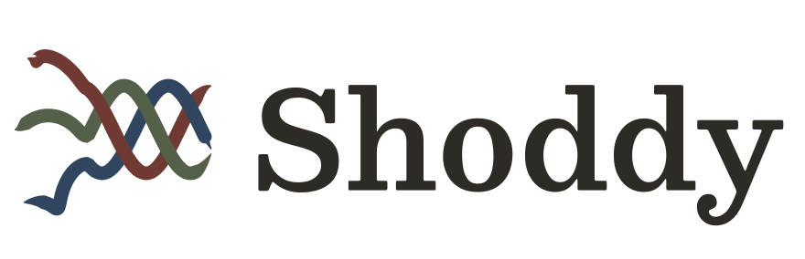
</picture>

[](https://github.com/shoddymills/shoddy/actions/workflows/ci.yml)

*Useless Things Made Useful Through Skill*

Three threads enter loose and run woven: rag stock in, cloth out. The mark,
the colours, and why they are these colours and no others, are in
[the heritage of the name](https://shoddymills.github.io/shoddy/heritage.html#the-mark).

A purely functional BASIC. Friendly typed syntax on the surface —
parenthesized calls, infix operators, `Let`, records, `Select Case`
pattern matching — compiled onto a concatenative (Forth/Joy-style) stack
core that remains a legal dialect. Python's layout, BASIC's keywords,
Joy's soul.

<p align="center">
  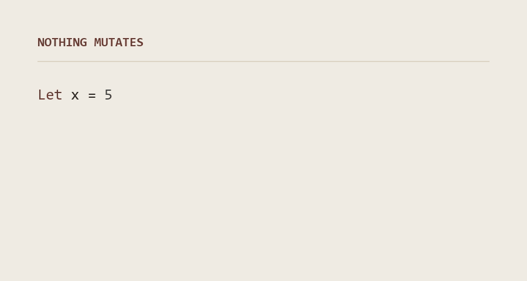
</p>

Nothing mutates: `Let` binds once, updates return new values, iteration
is recursion and `Map`/`Filter`/`Fold`. And the whole surface desugars to
stack code you can also write directly: `Def Square ( Number -- Number )`
/ `Dup *`.

## The showpieces

*Mungo Caverns, a purely functional reimagining of our favourite text
adventure — and Devil's Dust, the language's own name-story animated, with
a tuning console that goes to eleven.*

<table>
  <tr>
    <td align="center">
      <a href="https://shoddymills.github.io/shoddy/mills/mungo-caverns.html">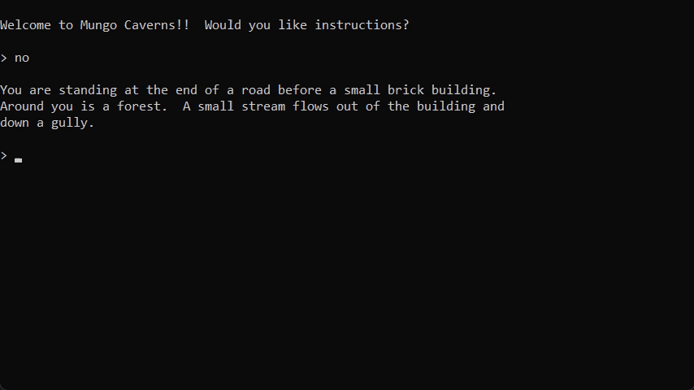</a><br>
      <b>Mungo Caverns</b><br><sub>the cave crawl, purely functional · graded against the original's transcripts</sub>
    </td>
  </tr>
  <tr>
    <td align="center">
      <a href="https://shoddymills.github.io/shoddy/mills/devils-dust.html">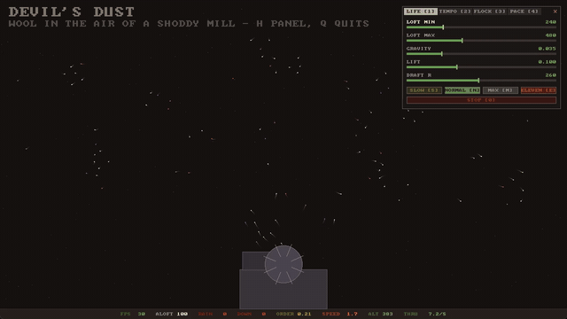</a><br>
      <b>Devil's Dust</b><br><sub>boids over the devil's drum · live console, machine-room drone</sub>
    </td>
  </tr>
</table>

## Two minutes to running

<table>
  <tr>
    <td width="55%" valign="middle">
      <b>One download is the whole toolchain.</b> The VS Code extension
      carries the mill and every machine inside it — install the
      <a href="https://dotnet.microsoft.com/download/dotnet/10.0">.NET 10 runtime</a>
      (the runtime, not the SDK), install the
      <a href="https://github.com/shoddymills/shoddy/releases/latest">latest <code>.vsix</code></a>,
      open any folder, and run. Nothing to clone, nothing to build, no
      environment to set: a bare <code>Include "seq.shoddy"</code> resolves
      anywhere, and breakpoints, variables, and the call stack work out of
      the box. Details under <a href="#install">Install</a>, or
      <a href="https://shoddymills.github.io/shoddy/setup.html">the two-step setup guide</a>.
    </td>
    <td width="45%" align="center" valign="middle">
      <a href="https://shoddymills.github.io/shoddy/vscode.html"></a><br>
      <b>Debug in VS Code</b><br><sub>breakpoints, variables, call stack</sub>
    </td>
  </tr>
</table>

## Start here — the tutorials

*Build a real program from an empty folder, learn the method for driving the
same craft with an AI assistant, then watch that method run at full size.*

<table>
  <tr>
    <td width="33%" align="center" valign="top">
      <a href="https://shoddymills.github.io/shoddy/tutorials/first-mill.html">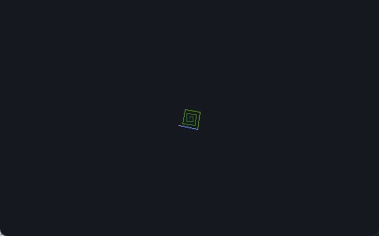</a><br>
      <b>Your First Mill</b><br><sub>an empty folder to a spirograph · tests, build files, and the debugger from the first run</sub>
    </td>
    <td width="33%" align="center" valign="top">
      <a href="https://shoddymills.github.io/shoddy/tutorials/with-ai.html">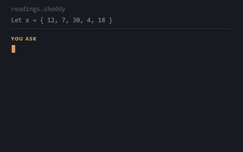</a><br>
      <b>Building with an AI</b><br><sub>requirements to shippable code · briefs, plans, verification, and blank templates</sub>
    </td>
    <td width="33%" align="center" valign="top">
      <a href="https://shoddymills.github.io/shoddy/tutorials/backgammon.html">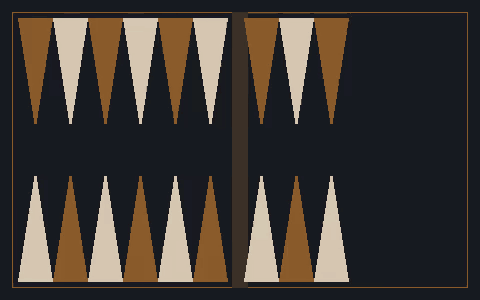</a><br>
      <b>Backgammon, by Specification</b><br><sub>the method at full size · every prompt for an engine and a game, written by a model</sub>
    </td>
  </tr>
</table>

Using Copilot or Claude on Shoddy? Ground it first —
[**Grounding an Assistant**](https://shoddymills.github.io/shoddy/assistants.html)
is a standing instructions file to drop in your project, plus worked
examples — a small program, the prompt you would type, and the Shoddy that
comes back. Every answer on the page was compiled and run before it went
there.

## See it run — every mill

Complete programs woven from the machines — each split into a headless,
unit-tested pure core and a thin I/O shell. Click through for the full
write-up on each one, or start at
[the mills catalog](https://shoddymills.github.io/shoddy/mills/index.html).

<table>
  <tr>
    <td width="25%" align="center" valign="top">
      <a href="https://shoddymills.github.io/shoddy/mills/mungo-caverns.html">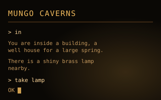</a><br>
      <b>mungo-caverns</b><br><sub>the cave crawl, purely functional</sub>
    </td>
    <td width="25%" align="center" valign="top">
      <a href="https://shoddymills.github.io/shoddy/mills/devils-dust.html">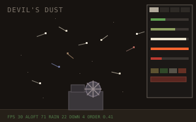</a><br>
      <b>devils-dust</b><br><sub>boids with a console · goes to eleven</sub>
    </td>
    <td width="25%" align="center" valign="top">
      <a href="https://shoddymills.github.io/shoddy/mills/invaders.html"></a><br>
      <b>invaders</b><br><sub>graphical window · colour + sound</sub>
    </td>
    <td width="25%" align="center" valign="top">
      <a href="https://shoddymills.github.io/shoddy/mills/oregon.html"></a><br>
      <b>oregon</b><br><sub>the 1971 classic, reclaimed</sub>
    </td>
  </tr>
  <tr>
    <td width="25%" align="center" valign="top">
      <a href="https://shoddymills.github.io/shoddy/mills/pac-vt100.html"></a><br>
      <b>pac-vt100</b><br><sub>arcade chase in the terminal</sub>
    </td>
    <td width="25%" align="center" valign="top">
      <a href="https://shoddymills.github.io/shoddy/mills/iris.html">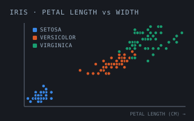</a><br>
      <b>iris</b><br><sub>neural classifier · trains in 4s</sub>
    </td>
    <td width="25%" align="center" valign="top">
      <a href="https://shoddymills.github.io/shoddy/mills/demographics.html"></a><br>
      <b>demographics</b><br><sub>neural regression · the other head</sub>
    </td>
    <td width="25%" align="center" valign="top">
      <a href="https://shoddymills.github.io/shoddy/mills/simplex-from-mps.html"></a><br>
      <b>simplex-from-mps</b><br><sub>83-var LP, solved from MPS</sub>
    </td>
  </tr>
  <tr>
    <td width="25%" align="center" valign="top">
      <a href="https://shoddymills.github.io/shoddy/mills/rag-and-bone.html"></a><br>
      <b>rag-and-bone</b><br><sub>a web server, in Shoddy</sub>
    </td>
    <td width="25%" align="center" valign="top">
      <a href="https://shoddymills.github.io/shoddy/mills/weather-glass.html"></a><br>
      <b>weather-glass</b><br><sub>a forecast, in VT100</sub>
    </td>
    <td width="25%" align="center" valign="top">
      <a href="https://shoddymills.github.io/shoddy/mills/tally.html">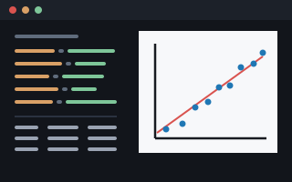</a><br>
      <b>tally</b><br><sub>statistics from a spec file</sub>
    </td>
    <td width="25%"></td>
  </tr>
</table>

## The machines — the whole shed

The standard library, one folder of Shoddy source per machine — graphics,
sound, statistics, neural nets, an LP solver, keyed files, and TCP/IP,
batteries included. Full word references in
[the machines catalog](https://shoddymills.github.io/shoddy/machines/index.html).

<table>
  <tr>
    <td width="25%" align="center" valign="top"><a href="https://shoddymills.github.io/shoddy/machines/seq.html">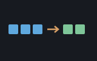</a><br><b>seq</b><br><sub>Map, Filter, Fold and friends</sub></td>
    <td width="25%" align="center" valign="top"><a href="https://shoddymills.github.io/shoddy/machines/str.html">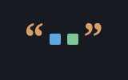</a><br><b>str</b><br><sub>string helpers</sub></td>
    <td width="25%" align="center" valign="top"><a href="https://shoddymills.github.io/shoddy/machines/math.html">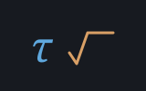</a><br><b>math</b><br><sub>the derived math layer</sub></td>
    <td width="25%" align="center" valign="top"><a href="https://shoddymills.github.io/shoddy/machines/eng.html">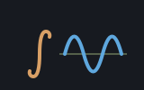</a><br><b>eng</b><br><sub>the engineer's calculator</sub></td>
    <td width="25%" align="center" valign="top"><a href="https://shoddymills.github.io/shoddy/machines/matrix.html"></a><br><b>matrix</b><br><sub>flat row-major matrices</sub></td>
  </tr>
  <tr>
    <td width="25%" align="center" valign="top"><a href="https://shoddymills.github.io/shoddy/machines/lin.html"></a><br><b>lin</b><br><sub>solve, factor, eigenvalues</sub></td>
    <td width="25%" align="center" valign="top"><a href="https://shoddymills.github.io/shoddy/machines/alg.html">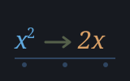</a><br><b>alg</b><br><sub>formulae as values</sub></td>
    <td width="25%" align="center" valign="top"><a href="https://shoddymills.github.io/shoddy/machines/stats.html">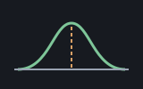</a><br><b>stats</b><br><sub>means to real p-values</sub></td>
    <td width="25%" align="center" valign="top"><a href="https://shoddymills.github.io/shoddy/machines/random.html"></a><br><b>random</b><br><sub>shuffles, samples, ranges</sub></td>
    <td width="25%" align="center" valign="top"><a href="https://shoddymills.github.io/shoddy/machines/neural.html">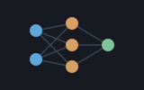</a><br><b>neural</b><br><sub>feed-forward nets, two heads</sub></td>
    <td width="25%" align="center" valign="top"><a href="https://shoddymills.github.io/shoddy/machines/money.html"></a><br><b>money</b><br><sub>exact cents, no drift</sub></td>
  </tr>
  <tr>
    <td width="25%" align="center" valign="top"><a href="https://shoddymills.github.io/shoddy/machines/file.html"></a><br><b>file</b><br><sub>line-oriented text I/O</sub></td>
    <td width="25%" align="center" valign="top"><a href="https://shoddymills.github.io/shoddy/machines/fin.html"></a><br><b>fin</b><br><sub>money over time</sub></td>
    <td width="25%" align="center" valign="top"><a href="https://shoddymills.github.io/shoddy/machines/recio.html">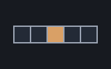</a><br><b>recio</b><br><sub>fixed-size binary records</sub></td>
    <td width="25%" align="center" valign="top"><a href="https://shoddymills.github.io/shoddy/machines/dict.html">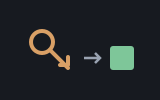</a><br><b>dict</b><br><sub>key/value over Pair lists</sub></td>
    <td width="25%" align="center" valign="top"><a href="https://shoddymills.github.io/shoddy/machines/isam.html">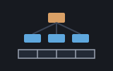</a><br><b>isam</b><br><sub>keyed files, B+tree index</sub></td>
  </tr>
  <tr>
    <td width="25%" align="center" valign="top"><a href="https://shoddymills.github.io/shoddy/machines/json.html">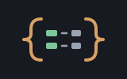</a><br><b>json</b><br><sub>JSON, both directions</sub></td>
    <td width="25%" align="center" valign="top"><a href="https://shoddymills.github.io/shoddy/machines/xml.html">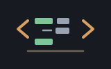</a><br><b>xml</b><br><sub>XML, both directions</sub></td>
    <td width="25%" align="center" valign="top"><a href="https://shoddymills.github.io/shoddy/machines/html.html"></a><br><b>html</b><br><sub>web pages, forgivingly</sub></td>
    <td width="25%" align="center" valign="top"><a href="https://shoddymills.github.io/shoddy/machines/csv.html">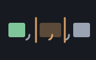</a><br><b>csv</b><br><sub>tables, quoted properly</sub></td>
    <td width="25%" align="center" valign="top"><a href="https://shoddymills.github.io/shoddy/machines/shaker.html">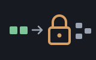</a><br><b>shaker</b><br><sub>reversible obfuscation</sub></td>
  </tr>
  <tr>
    <td width="25%" align="center" valign="top"><a href="https://shoddymills.github.io/shoddy/machines/net.html">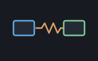</a><br><b>net</b><br><sub>TCP/IP, non-blocking</sub></td>
    <td width="25%" align="center" valign="top"><a href="https://shoddymills.github.io/shoddy/machines/https.html"></a><br><b>https</b><br><sub>HTTP over TLS</sub></td>
    <td width="25%" align="center" valign="top"><a href="https://shoddymills.github.io/shoddy/machines/simplex.html"></a><br><b>simplex</b><br><sub>linear programming</sub></td>
    <td width="25%" align="center" valign="top"><a href="https://shoddymills.github.io/shoddy/machines/mps.html">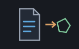</a><br><b>mps</b><br><sub>the LP file format</sub></td>
  </tr>
  <tr>
    <td width="25%" align="center" valign="top"><a href="https://shoddymills.github.io/shoddy/machines/clock.html"></a><br><b>clock</b><br><sub>timing and timestamps</sub></td>
    <td width="25%" align="center" valign="top"><a href="https://shoddymills.github.io/shoddy/machines/vt100.html"></a><br><b>vt100</b><br><sub>terminal control codes</sub></td>
    <td width="25%" align="center" valign="top"><a href="https://shoddymills.github.io/shoddy/machines/keys.html"></a><br><b>keys</b><br><sub>key codes to GameKeys</sub></td>
    <td width="25%" align="center" valign="top"><a href="https://shoddymills.github.io/shoddy/machines/scribbler.html">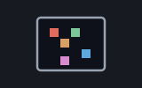</a><br><b>scribbler</b><br><sub>pixels in a window</sub></td>
  </tr>
  <tr>
    <td width="25%" align="center" valign="top"><a href="https://shoddymills.github.io/shoddy/machines/turtle.html"></a><br><b>turtle</b><br><sub>purely functional turtles</sub></td>
    <td width="25%" align="center" valign="top"><a href="https://shoddymills.github.io/shoddy/machines/plotter.html">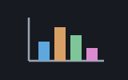</a><br><b>plotter</b><br><sub>statistical charts</sub></td>
    <td width="25%" align="center" valign="top"><a href="https://shoddymills.github.io/shoddy/machines/buzzer.html"></a><br><b>buzzer</b><br><sub>notes, MML tunes, three waves</sub></td>
    <td width="25%"></td>
  </tr>
</table>

## The name

Shoddy takes its name from the shoddy trade of the West Riding of
Yorkshire. From 1813, the mills of Ossett, Morley, and Wakefield did what
the wool trade thought impossible: they took worn-out rags, tore them back to
fiber in a grinding machine called the devil, blended the reclaimed
stock with new wool, and spun and wove it into cloth again — blankets,
working clothes, and the uniforms of half the world's armies. The
American Civil War made the word a slur; the mills went on making honest
cloth for a century regardless, until synthetic fibers ended the trade.
This language is built the same way: old ideas — BASIC, Forth, Joy,
ISAM — reclaimed, blended with new wool, and woven into something
useful. Hence the **mill** (the executable) and its **machines** (the
libraries). And the tagline is Ossett's own: *Useless Things Made Useful
Through Skill* renders that town's civic motto, *Inutile Utile Ex Arte*
("the useless made useful by skill"), meant here literally. The full story
is in [the heritage of the name](https://shoddymills.github.io/shoddy/heritage.html).

## Layout

| Path  | Contents                                                    |
|-------|-------------------------------------------------------------|
| `src/`| The .NET solution: `Shoddy.Runtime` · `Shoddy.Devil` (front-end) · `Shoddy.Mill` · `Shoddy.Compiler` · `Shoddy.Tests` |
| `bin/`| Build output — the published `mill` toolchain lands here after `dotnet publish` (not committed; build it, then run `bin/mill`) |
| `machines/`| Standard library (the machines): `seq` `str` `math` `matrix` `stats` `random` `neural` `money` `file` `recio` `dict` `isam` `net` `simplex` `mps` `clock` `vt100` `keys` `scribbler` `turtle` `plotter` `buzzer` |
| `mills/`| Complete example programs (the mills), each with its own build wrapper: `mungo-caverns` (Colossal Cave Adventure) · `oregon` (overland-trail game, after MECC's 1971 original) · `pac-vt100` · `invaders` · `demographics` (neural income model, regression) · `iris` (neural species classifier, ~4s to train) · `simplex-from-mps` (LP solver) |
| `docs/`| `index.html` (start here) · `guide.html` · `tutorials/` (three build-alongs) · `setup.html` (one-time machine setup) · `vscode.html` (editor) · `build.html` (the toolchain) · `stack.html` (the stack, traced) · `spec.html` · `quickref.html` · `errors.html` (every message and its cause) · `assistants.html` (grounding an AI) · `heritage.html` (the name) · `machines/` and `mills/` (one page each) |
| `tst/`| `libtest.shoddy` (assertion suite) · `examples.shoddy` · `gradebook.shoddy` · `simplex.shoddy` · demos (`scribbler-` `turtle-` `plotter-` `buzzer-` `net-demo.shoddy`) · `golden/` (the constitution) |
| `vscode-shoddy/`| VS Code extension: highlighting, snippets, debugging, mill commands |

## Install

Most people want the VS Code extension. It carries its own mill and the whole
machine library, so it is the entire install — download the latest `.vsix` from
[the latest release](https://github.com/shoddymills/shoddy/releases/latest),
then in VS Code press **Ctrl+Shift+P** (**Cmd+Shift+P** on macOS), run
**Extensions: Install from VSIX…**, and choose the file you downloaded.

The only prerequisite is the [.NET 10 runtime](https://dotnet.microsoft.com/download/dotnet/10.0)
(the runtime, not the SDK). Nothing to clone, nothing to build, no environment to
set: a bare `Include "seq.shoddy"` resolves in any folder you open. See
[the setup guide](https://shoddymills.github.io/shoddy/setup.html).

## Build from source

For working on the language itself, or to get `mill` on your command line.
Requires the .NET 10 SDK. Build the mill (it isn't committed), then run a
program and the tests:

```
dotnet publish src/Shoddy.Mill -c Release -o bin   # build the mill into bin/
bin/mill run tst/examples.shoddy                   # compile in memory and run
dotnet test src/Shoddy.Tests                       # golden conformance suite
```

Or use the build wrapper — `./build.sh <cmd>` on Linux/macOS/WSL,
`build.cmd <cmd>` on Windows — which bundles the common tasks: `build`,
`test`, `run FILE`, `machines`, `stage`, `vsix`, `clean`.

`vsix` packages a self-contained VS Code extension: it stages the mill and
every machine into the package, so installing the `.vsix` needs only the
.NET 10 *runtime* — no SDK, no checkout, no `SHODDYLIB`.

The full toolchain — weaving to an assembly, building library machines, and
the Windows PowerShell notes — is in [the toolchain guide](https://shoddymills.github.io/shoddy/build.html).

## Documentation

The whole site is at **[shoddymills.github.io/shoddy](https://shoddymills.github.io/shoddy/)**.

**Learn** — [the front door](https://shoddymills.github.io/shoddy/index.html), every guide and
reference organized by what you came for ·
[the beginner's guide](https://shoddymills.github.io/shoddy/guide.html), which assumes no prior
knowledge · [the tutorials](https://shoddymills.github.io/shoddy/tutorials/index.html), three
build-alongs starting from an empty folder ·
[grounding an assistant](https://shoddymills.github.io/shoddy/assistants.html), a standing
instructions file for Copilot or Claude.

**Reference** — [the specification](https://shoddymills.github.io/shoddy/spec.html), including the
concatenative core (Appendix A) and design rationale (Appendix B) ·
[the quick reference](https://shoddymills.github.io/shoddy/quickref.html), every builtin word, type
and syntax form on one page, plus a map of the machines ·
[errors and warnings](https://shoddymills.github.io/shoddy/errors.html), every message the toolchain
can raise, its cause, and broken and fixed code side by side ·
[the stack](https://shoddymills.github.io/shoddy/stack.html), the machine under the costume, watched
one word at a time.

**Set up and build** — [setup](https://shoddymills.github.io/shoddy/setup.html), two steps once per
machine · [VS Code](https://shoddymills.github.io/shoddy/vscode.html), debugging, snippets and the
Run button · [the toolchain](https://shoddymills.github.io/shoddy/build.html), every mill command,
wrapper and convention.

**Also** — [the machines](https://shoddymills.github.io/shoddy/machines/index.html) and
[the mills](https://shoddymills.github.io/shoddy/mills/index.html), one page each ·
[the heritage of the name](https://shoddymills.github.io/shoddy/heritage.html) ·
[authorship](https://shoddymills.github.io/shoddy/authorship.html), who made
Shoddy and with what tools.

## Getting help, and what's new

- **[Discussions](https://github.com/shoddymills/shoddy/discussions)** — questions, ideas, and
  anything that doesn't fit an issue.
- **[Issues](https://github.com/shoddymills/shoddy/issues)** — bugs and feature requests.
- **[Releases](https://github.com/shoddymills/shoddy/releases)** — what changed in each version,
  with the `.vsix` to download. The notes are written per tag in
  [release-notes/](release-notes/); there is no separate changelog.

## Language at a glance

- Types: Number, String, Boolean, Quotation (closures), List, Array, and
  user records via `Type` — every field name becomes an accessor function
  (`Score(s)`), composable like any other (`Map(class, Score)`). No NULL:
  variant types (`Type Option = Some(v) | None`) make "maybe nothing" a
  value you pattern-match, not a check you can forget. Booleans are not
  numbers.
- Purity: no assignment, no `goto`, no `for`; `Print`/`Input`/`Rnd` are
  the only effects, kept at the edges by convention.
- `Select Case` matches values, ranges (`4 To 10`), comparisons
  (`Is >= 90`), and destructures records and variants (`Case Some(v)`,
  `Case None`) with `Where` guards.
- `Include "FILE.SHODDY"` splices files (include-once) — resolved beside the
  including file, then `SHODDYLIB`, then the machine library beside the running
  mill, so a bare `Include "seq.shoddy"` works from any folder.
- Errors carry source line numbers; `Assert` and `Error` are built in.

## License

Shoddy is free and open source under the **[MIT License](LICENSE)** — use it
for anything, including commercially, with attribution.

Third-party dependencies and the historical/homage example programs (OREGON,
the Pac-Man and Space Invaders homages, and a neural-net reference) remain
under their own licenses and their owners' trademarks. The Colossal Cave
Adventure port ([mills/mungo-caverns/](mills/mungo-caverns/)) derives from
Crowther & Woods via Eric Raymond's Open Adventure and is **BSD-2-Clause**; see
its [LICENSE](mills/mungo-caverns/LICENSE) and
[THIRD-PARTY-NOTICES.md](THIRD-PARTY-NOTICES.md).

Contributions are welcome under the MIT License; see
[CONTRIBUTING.md](CONTRIBUTING.md) and the [Code of Conduct](CODE_OF_CONDUCT.md).
This project intends to join the [.NET Foundation](https://dotnetfoundation.org/).

Authorship, and the disclosure of which tools were used in the making of Shoddy
and how, is in **[AUTHORSHIP.md](AUTHORSHIP.md)** — stated at length, with the
development record and the legal position, on
[the Authorship page](https://shoddymills.github.io/shoddy/authorship.html).

## Status

Version 1.0, and the toolchain is real: a 100%-compiled .NET language —
every program weaves to C# and compiles with Roslyn, either in memory
(`mill run`) or to an assembly on disk (`mill weave`) — with tail-call
optimization, separately-compiled library machines, a self-hosted
standard library, and a golden conformance suite graded byte-for-byte.
The programs in `mills/` are not syntax demonstrations; they are
complete, working software.

Shoddy is young, and there is work still ahead. Type annotations are
parsed and enforced at runtime, but the mill now carries a weave-time
linter with stack-effect inference: every `Def`'s net effect is checked,
branches must agree, call sites are depth-checked against declared
arities (machine manifests carry their words' effects), and an unknown
word is a weave error rather than a runtime crash. Warnings never stop a
build (`--no-lint` silences them; `--lint-verbose` reports coverage), and
the checker skips what it cannot prove rather than guess. Full static
*type* checking remains ahead, alongside a REPL and catchable errors.
